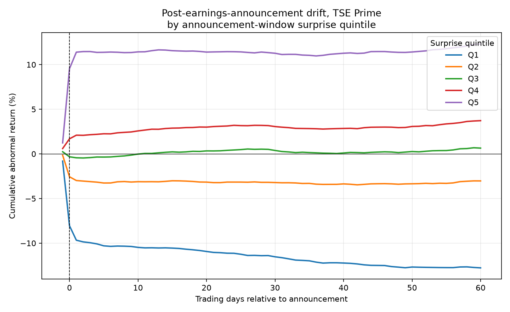

# Post-Earnings-Announcement Drift in Japanese Equities

Does the Japanese market actually price earnings news on day one, or do stocks keep drifting in the same direction for weeks? I built this data pipeline and event study to finally find out. 

Spoiler: they drift.



## What I found

Yes, the drift is real, and it actually survives the clustering test that usually kills these kinds of anomalies.

If you sort about 7,400 of the most extreme-surprise earnings announcements into quintiles, the best-surprise group (Q5) and worst-surprise group (Q1) pull apart by **+4.02%** over the 60 trading days *after* the announcement (once you strip out the mechanical jump from the sort itself). 

A naive t-test on that spread comes out to 6.79. That looks amazing, but it's totally wrong: roughly 70% of these companies report earnings within the same few weeks each year, so their abnormal returns aren't actually independent. When you cluster the standard errors by announcement date instead, the t-stat drops to **3.14**. It's still significant, just honestly so.

One really interesting detail I noticed in the data: the drift isn't symmetric. Almost all of the post-day-1 movement comes from the worst-surprise quintile continuing to bleed out. The best-surprise quintile is basically flat after its initial jump. Basically, bad news takes longer than a single day to fully price in, but good news doesn't.

---

## Keeping myself honest (Pre-registered spec)

I locked in the table below before I ran any of the numbers. I really wanted to avoid accidentally p-hacking my way to a result or doing any retroactive specification searching.

| Choice | Primary specification |
|---|---|
| Universe | TSE Prime constituents, liquidity-filtered |
| Event | First disclosure of a quarterly/annual earnings summary (*tanshin*) |
| Day 0 | First tradable session after disclosure (see convention below) |
| Estimation window | `[-150, -30]` trading days |
| Event window | `[-1, +60]` trading days; drift measured over `[+2, +60]` |
| Normal return | Market model, OLS, vs an equal-weighted market index |
| Surprise measure | `CAR[-1, +1]` (announcement-window abnormal return) |
| Sorting | Quintiles, assigned **within** each announcement period |
| Headline number | `Q5 - Q1` cumulative abnormal return over `[+2, +60]` |
| Inference | Naive t-stat reported, then standard errors clustered by announcement date |

I did look at a few alternatives (like market-adjusted returns and stricter liquidity filters), but strictly as robustness checks, not as cherry-picked replacements for this primary spec.

## The Day-0 headache

In Japan, most *tanshin* drop after the 15:30 close, which makes timing a bit of a nightmare. If a disclosure hits at or after 15:00 on date *t*, no one can trade it until the next session, making the *next* day event day 0. Anything before 15:00 makes date *t* day 0. If you mess this up by a single day, your entire event window is garbage.

## API quirks & workarounds

I used the [J-Quants API](https://api.jquants.com/v2) for this (just standard `x-api-key` auth). The setup is super easy, but I was on their free tier, which honestly dictated a lot of the architecture:

*   **No TOPIX on the free plan.** Because I couldn't pull the actual benchmark, I had to build my own equal-weighted index from the sample universe. There's a catch here: since Japanese earnings cluster heavily in specific weeks, my custom benchmark index ends up containing the very stocks I'm studying, which absorbs some of the anomaly. This actually biases the drift estimate **towards zero**. It makes the test more conservative, but it’s definitely worth keeping in mind.
*   **SUE (Standardized Unexpected Earnings) was off the table.** Calculating a seasonal random walk requires about 12 quarters of history, but the free plan only gives you 2 years (8 quarters). That forced me to use the announcement-window return as my surprise measure instead.
*   **Brutal rate limits.** The free tier has a 12-week data delay and a hard limit of **5 requests/minute**. To avoid getting throttled to death, I built the pipeline to fetch data by date rather than by ticker. Pulling by date grabs the whole cross-section in one request (~490 requests total) instead of taking hours to loop through ~4,000 individual stocks.

## Sample construction

| Stage | Count |
|---|---|
| Trading days downloaded | 484 (2024-06-20 to 2026-06-16, the free plan's window) |
| Earnings disclosures identified | 31,519 |
| Usable events (enough data in both windows) | 18,471 (59%) |
| Events in the headline Q5/Q1 comparison | 7,387 (3,682 + 3,705) |

That drop from 31k to 18k is mostly just events sitting too close to the edges of my two-year data window to have a full estimation/event window around them. I didn't exclude anything just because the data looked inconvenient.

## Robustness checks

I ran three alternative specs just to make sure the headline number wasn't a fluke. I'm reporting them right alongside the primary one:

| Specification | Q5−Q1 drift `[+2,+60]` | Clustered t | N |
|---|---|---|---|
| Market model (primary) | +4.02% | 3.14 | 7,387 |
| Market-adjusted, β forced to 1 | +2.45% | 2.26 | 7,387 |
| Clean index (excludes stocks mid-event) | +4.33% | 3.23 | 7,387 |
| Liquidity filter (drop bottom turnover decile) | +4.01% | 3.13 | 7,087 |

The market-adjusted version is noticeably weaker, which makes sense: betas across these stocks range from -3.3 to 5.9, so forcing every stock to move 1-for-1 with the market throws away real info and adds noise. The clean-index check moved exactly how I expected—removing the benchmark overlap made the effect slightly bigger. Finally, the liquidity filter barely moved anything, which is reassuring — it suggests this result isn't just an artifact of penny-stock noise.

## Limitations

- **Two years of history:** The J-Quants free plan capped my statement history at roughly two years, well short of the 8-12 quarters a proper SUE surprise measure needs. 
- **No TOPIX:** As mentioned above, my benchmark is a sample-built equal-weighted index, not the real market.
- **Survivorship bias:** The universe is today's listed companies, looked backward. Anything that delisted or went bankrupt during the window isn't in this data. Since those are disproportionately the bad-news firms, the true bottom-quintile return is probably even worse than what I caught here.
- **Thin trading:** There are a meaningful number of small, barely-traded names in here that produced obviously bad daily returns (sometimes 50%+ moves on stocks worth a few yen a share). The liquidity filter shows this isn't driving the headline result, but the noise is definitely present in the raw data.

## Setup

```bash
pip install -r requirements.txt
cp .env.example .env    # then paste your key from [https://jpx-jquants.com/](https://jpx-jquants.com/)
python src/discover.py  # verify the key and inspect live response schemas

```

## Reproducing the result

```bash
python src/run_pipeline.py

```

That single command runs the whole pipeline end-to-end: fetching ~2 years of prices and disclosures, loading everything into DuckDB, computing returns and the market index, building the event panel, fitting the market model, sorting into surprise quintiles, and generating the charts.

*Note: The fetching part is slow because of the 5 requests/minute cap, so budget a few hours if you're running this on a clean clone. The good news is every API response is cached to disk as it downloads—if your run dies partway through, just run it again and it'll pick up right where it left off.*